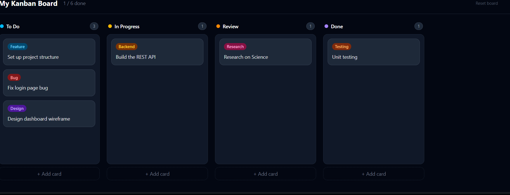

📋 Kanban Board
A drag-and-drop task management board built with React. Organize tasks across columns — To Do, In Progress, Review, and Done. Board data persists across page refreshes using localStorage.

✨ Features

Drag and drop — move cards between columns or reorder within a column
Add cards — click "+ Add card" in any column, type a task, pick a label
Label badges — colour-coded tags (Feature, Bug, Backend, Design, Testing, Deploy)
Persistent data — everything saved in localStorage, survives page refresh
Editable board title — click the title to rename your board
Live card count — each column shows how many cards it has
Keyboard shortcuts — press Enter to save a card, Escape to cancel

🖥️ Screenshot

Show Image

🛠️ Tech Stack
| Technology | Purpose |
|------------|---------|
| React 18 | UI components and state management |
| Vite | Build tool and dev server |
| Tailwind CSS | Styling |
| @hello-pangea/dnd | Drag and drop |
| uuid | Unique IDs for each card |
| localStorage | Saving board data in the browser |

📁 Project Structure
kanban-board/
├── src/
│   ├── components/
│   │   └── Column.jsx      # Single column with add-card form
│   ├── App.jsx             # Main app — all state and logic
│   ├── initialData.js      # Starting board data
│   ├── main.jsx            # React entry point
│   └── index.css           # Tailwind CSS imports
├── index.html
├── vite.config.js
└── package.json

🚀 Run Locally
Prerequisites: Node.js v18+
bash# Clone the repo
git clone https://github.com/student-Always-sn/taskflow-kanban-board.git

# Enter the folder
cd kanban-board

# Install dependencies
npm install

# Start dev server
npm run dev
Open http://localhost:5173 in your browser.
bash# Build for production
npm run build
Deploy by dragging the dist/ folder to Netlify — free hosting in 2 minutes.

💡 How It Works
Data structure
Columns and cards are stored separately. Each column only holds a list of card IDs — not the card data itself. This keeps drag-and-drop simple: moving a card means moving its ID from one column's array to another.
js{
  columns: {
    'col-1': { id: 'col-1', title: 'To Do', cardIds: ['card-1', 'card-2'] }
  },
  cards: {
    'card-1': { id: 'card-1', text: 'Fix login bug', label: 'Bug' }
  }
}
Component responsibilities

App.jsx — owns all state, handles add / delete / drag-end logic
Column.jsx — renders one column, manages the add-card form with local state

State flow
Data flows down via props. Events flow up via callback functions passed as props. Column never modifies state directly — it calls onAddCard() or onDeleteCard() and App.jsx handles the update.

🔮 Planned Features

 Card component with individual delete button
 User authentication (login / signup)
 Multiple boards per user
 Real-time collaboration with Socket.io
 Due dates and priority levels
 REST API backend — Node.js + MongoDB

🧠 React Concepts Used

useState — managing board data and form state
useEffect — saving to localStorage on every change
Lifting state up — all logic in App.jsx, components just display
Controlled inputs — React-managed textarea and select
Conditional rendering — toggling between button and form
Normalised state — separating card IDs from card data
Immutable updates — spread operator to never mutate state directly

👨‍💻 Author
Sakshi 
GitHub: https://github.com/student-Always-sn
